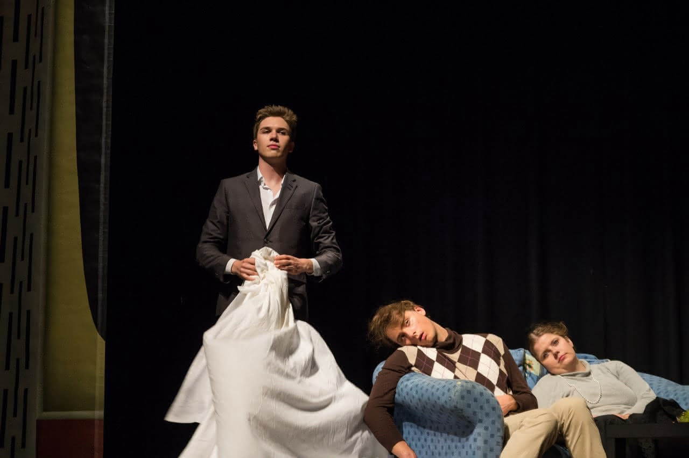

I was never a classic theatre kid in school. So why am I so obsessed with theatre now?

That is not entirely true, though. I did two school musicals because I sang in the choir, and I spent time backstage doing lights and sound. But when I moved to Karlsruhe for university, it felt like everyone around me had done bigger shows and had more experience. For a while, I told myself: no more theatre.

## Loriotesk!
After a two-year hiatus, a friend asked if I wanted to join a theatre project. He said comedy might suit me, and he was right. A few weeks later, six of us were developing a play from Loriot sketches, directing and performing it ourselves.

We reinterpreted and connected these well-known scenes into one story about relationships, boredom, and media. By the end of the run, I was completely hooked again.

 *Loriotesk: The TV is not why our relationship is in shambles*

## Jugend Ohne Gott / The Age of Fishes
The Age of Fishes was my first project with Junges Staatstheater Karlsruhe, directed by [Jakob Weiss](https://jakobweiss.de/). I was part of the pupils' speaking choir. Horvath's story follows a teacher facing the violent, unreflected ideology of his fascist students.

The play asks urgent questions about responsibility, morality, and action in a society shaped by fear and lies.
 *The teacher and his students in Age of Fishes (Photo: Felix Grünschloß)*

I performed this piece more than 30 times for over 3,000 viewers, including a guest performance in Pakistan. After many shows, I got to discuss its themes with audiences, especially students, and those conversations meant a lot to me.

The production taught me how group dynamics work, onstage and in everyday life. It is easy to get pulled in by loud voices and the comfort of the majority. Theatre gave us a safe space to explore these extremes. Onstage it looked harsh and militaristic; backstage it required empathy, precision, and deep trust.

## Woyzeck
Woyzeck, directed by Manuel Schüler with twelve young actors from Karlsruhe, is one of those plays that cuts deep. Buchner's story shows how social pressure, humiliation, and medical abuse break a person down.

I played the Hauptmann, Woyzeck's superior. It was a demanding role, especially with limited rehearsal time, because the piece is full of oppression, dependency, and unstable relationships. It asked for careful character work and a lot of sensitivity.

For me, theatre is one of the few places where you can truly see how you appear to others and what your presence does in a room.

## tick, tick... BOOM!
tick, tick... BOOM! is a rock musical by Jonathan Larson.

Over nearly two years, I developed and managed this project as project lead and dramaturg. More than 20 volunteers were involved: technicians, band, director, and set team. Keeping that many people aligned was hard and beautiful at the same time.

The story hit close to home for my generation. Jon is about to turn thirty and feels torn between artistic purpose and financial security. That tension between passion and "success" felt very real.

 *Jon and Micheal throwing paper over the band (Photo: Ramona Just)*
> Cages or Wings, which do you prefer?

## Honiefaith
During the third wave of the pandemic, I was asked to direct the European premiere of Honiefaith by Monty DiPietro. The play explores the world of Japanese "hostess clubs" through the eyes of foreign women working there.

 *Reporter Balmori uncovers more of the background of the murder (Photo: T. Schlinck)*

When a Filipino hostess's dismembered body is found in a locker in Tokyo, journalist Victor Balmori is pulled into a violent and unsettling world. He starts by chasing a story, but soon finds a nightmare shaped by systemic racism and the complexities of the Japanese police system.

## Hamlet

For years, I dreamed of directing Hamlet. The idea first took shape in 2019, then had to wait through the pandemic and the start of my day job, until it finally became reality in 2025.

Together with a truly fabulous cast and crew, whom I cannot thank enough, we created an immersive, innovative, and funny version of the play. Our local newspaper wrote that it raised the bar for amateur productions and that "a city and university can be happy to have such a great student theatre."

For me, it was the culmination of everything I had learned over the years in acting and directing and, at the same time, a real stretch. We worked with tons of material, built an in-the-round live-video setup, and pushed through long rehearsals full of sweat, tears, physical intensity, and emotional openness. In the end, it became exactly the kind of Hamlet I had hoped for.

Now I am curious to see what comes next. Maybe this production will even win an award.

## Improvisation
I love improvisation. Together with a diverse group of amazing people, I teach, train, and perform this art of spontaneous creation.

For me, improvisation is more than performance. It is a way to practice listening, presence, trust, and vulnerability. It teaches you when to lead, when to follow, and how to build something meaningful together in the moment.

 *Performance with the Improtheater Karlsruhe (Photo: Arthur Leon)*

List of my Trainers:
*Julius Anton, Zacharias Heck, Zohra Ighli, Manuel Speck, Hila Di Castro, Anna Preminger, Jun Imai, Delia Riciu, Stephen Davidson, Andrew Hefler, Laura Doorneweerd-Perry, Gael Doorneweerd-Perry, Jutta Tivlis, Jacob Banigan, Mario Müller, Nicole Erichsen, Ilka Metzner,*

## Recent Projects

With a day job, theatre has become a smaller part of my week. I shifted my focus from performing to backstage work, especially supporting directors.

Here are some recent projects:

| **Production**                                                                       | **Director/Theatre**            | **Role**                       |
| ------------------------------------------------------------------------------------ | ------------------------------- | ------------------------------ |
| Verschwörung gegen die Liebe                                                         | Frank/GeisozTheater             | Intimacy Coordination          |
| Ein Stück vom Abendstern                                                             | Azarfar/UniTheater              | Directing Support              |
| Nabucco (Opera)                                                                      | Strassberger/Staatstheater KA   | Various (Statisterie)          |
| Porträt einer jungen Frau in Flammen (Jul 24)                                        | Wagner/UniTheater               | Intimacy Coordination/Movement |
| Das Bildnis des Dorian Gray  (Oct 24)                                                | Anton & Wachter/UniTheater      | Video Direction and Projection |
| Momo  (Nov 24)                                                                       | Middel & Ott/UniTheater         | Ensemble                       |
| [Der Rosenkavalier](https://www.staatstheater-karlsruhe.de/programm/info/3650/) (Opera) | Homoki /Staatstheater Karlsruhe | Various (Statisterie)           |
| [**Hamlet**](https://www.unitheater.de/produktion/hamlet/) (2025)                        | UniTheater                      | Direction                       |
| [Bunbury](https://www.unitheater.de/produktion/bunbury-ernst-sein-ist-alles/?) (2026)    | Götzelmann/UniTheater           | Fight & Intimacy Coordination   |
| [LSS 4.0](https://www.unitheater.de/produktion/long-story-short-3-0/)                    | UniTheater                      | [[regie|Directing Workshop]] & Support |

I am excited to see what this year brings next.

## Education
Theatre has helped me develop both personally and socially, so I try to pass that on wherever I can. I care a lot about creating brave spaces where people can explore themselves and each other.

At [UniTheater Karlsruhe](https://unitheater.de), we run weekly workshops with changing topics. I have led sessions on improvisation, directing, singing and speaking, and mindfulness. I am still amazed by how much one small exercise or one practical note can unlock for someone.

To keep growing as a group leader, I regularly train with theatre professionals. [[playing|I love sharing what I learn.]] I still train and support others in both directing and acting, with a current focus on physical theatre and the expressive potential of the body.

 *Workshop at the UniTheater Karlsruhe*

My directing style is naturalistic, fast-paced, physical, and expressive.
