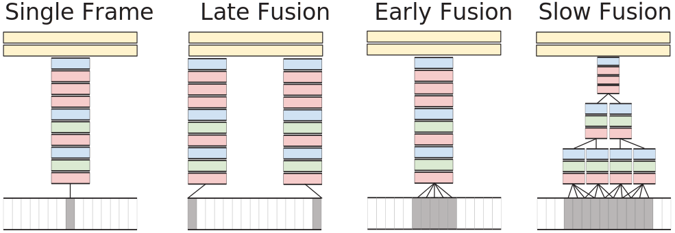

---
title: Summary Convolutional Neuronal Networks
Tags: machine learning, artificial Intelligence, convolution, summary, neuronal network, ai, pooling, multi-task
date: 2020-07-17 8:11:00
slug: cnn
summary: Convolutional neuronal networks have revolutionized Machine Visions. This provides an overview of the machinanism (filters, pooling and more) under the hood.
--- 
Convolutional Neuronal Networks utilize convolution-based filters to automatically detect edges and hierarchically sum them up to features. Classic methods rely on manual feature extraction, expert knowledge and are often domain-specific.  The training of CNNs is done by optimizing the filters to build features. We call the data transferred between layers, feature maps.
## Convolution
* Slide Filter of size $F\times F$ over the Image with some step size (stride)
* Parameters:
    * Zero Padding $P$: Number of Zeros on each side
    * Stride $S$: Number of Pixels moved after operation
    * Filter Lenght $F$
    * Input Length $I$
* Output Size $O=\frac{I-F+P_{start}+P_{end}}{S}+1$

$$h_{j}^{n}=\max \left(0, \sum_{k=1}^{K} h_{k}^{n-1} * w_{k j}^{n}\right)$$  
with $h_j$ the output feature map,  
$h_k$ the input features,  
$w_kj$ the kernel

&rarr; [Visual Guide & more](https://stanford.edu/~shervine/teaching/cs-230/cheatsheet-convolutional-neural-networks#layer) 
## Pooling
> A pooling function replaces the output of the net at a certain location with a summary statistic of the nearby output.

This is mostly used for small patches (between 2-5 wide)

* Max-Pooling: Use Maximum of patch
* Average/Sum-Pooling: Use Average/Sum of Patch
* Overlapping Pooling: Let the pooling patches overlap by setting $S<F$ (common $S=2$, $F=3$). Can improve overfitting issues

Pooling is usefull for better invariance of translation (the result depending on the position in the picture) and distortion, while reducing the data size.
## Training
### Loss Function
Loss Fuction are the feedback for the network, that is backpropagated to optimize the weights. Our goal is to give the network a good score based on its output. There are different measures involved to define the distance of the output to the actual label.
#### Classification
* **Cross Entropy**: $L_{CE}=-\frac{1}{N} \sum_{i=1}^{n} \log \left(p_{i}\right)$, provides high loss for wrong predictions that the classifier is confident in.
* **Hinge Loss** to add the optimal margin to the Loss function
* **SoftMax**  $L_{\text{SoftMax}}=-\frac{1}{N} \sum_{i=1}^{n} \log \left(\frac{e^{s y_{i}}}{\Sigma_{j} e^{s_{j}}}\right)$ Interpreting the classifier outputs as probabilities
#### Regression
* **Mean Squared Error** (MSE): $L_{M S E}=\frac{1}{N} \sum_{i=1}^{n}\left(h\left(x_{i}\right)-y_{i}\right)^{2}$
* **Mean Absolute Error** (MAE): $L_{M A E}=\frac{1}{N} \sum_{i=1}^{n}\left|h\left(x_{i}\right)-y_{i}\right|$ compared to MSE, big deviation have less impact on the loss
* **Mean Squared Logarithmic Error** (MSLE): $L_{M S L E}=\frac{1}{N} \sum_{i=1}^{n}\left(\log \left(h\left(x_{i}\right)+1\right)-\log \left(y_{i}+1\right)\right)^{2}$, less impact for big deviations.

### Gradient Descent
There are multiple variants of Gradient Descent depending on the number of data points used per iteration

* **Batch Gradient Descent**. One weight update for all data &rarr;  slow convergence for big datasets 
* **Stochastic Gradient Descent**. One weight update per data sample &rarr; volatile learning 
* **Mini Batch Gradient Descent**. One weight update per mini-batch of data &rarr; the bigger the better, dependent of available hardware

Gradient Descent was optimized with different variations in the past years

* **Momentum**. Using the last update direction to increase/decrease Momentum. 
* **Nesterov**. Look ahead by approximating the next location and calculate the gradient at this point.
* **AdaGRAD**. Decrease Learning Rate with time
* **AdaDelta**. Changing Learning Rate not necessarily decreasing with time
* **ADAM**

## Fully Convolutional Networks (FCN)
Instead of using fully-connected layers for the Classification use Convolutional layers. Both networks are the same, for the same input size, but Fully Convolutional Networks (FCN) can work with bigger input sizes. Used this way, they can output probability maps. 

## Segmentation
Goal: For each pixel return the class with the highest probability.

The issue is the low resolution of the classification, but we want to be pixel-perfect.

### Upsampling Methods
* **Nearest Neighbor**. Use the same value as the neighbors
* **Bed of Nails**. Copy original value to a specific location, fill rest with zero
* **Max Unpooling**. Save the location of the maximum when max-pooling and reconstruct the image by adding back the value at this location. 

## Object Detection
Classic approaches run classification for each region. Regions are selected by sliding window (with different image size (Pyramid)) or Interest Point Detector (region proposals)

CNN can run either as a two-stage approach, by running the CNN on each selected regions or a one-stag approach were the CNN runs without previous region selection (Fast(er) R-CNN by [@@girshick2015fast] and [@@ren2015faster]).

Bounding Boxes of the objects are represented by 

1. 2 corner points on opposing sides
2. 1 corner point + width, height
3. middle point + width, height

## MultiTask Networks
> Multitask Learning is an approach to inductive transfer that improves generalization by using the domain information contained in the training signals of related tasks as an inductive bias. It does this by learning tasks in parallel while using a shared representation; what is learned for each task can help other tasks be learned better. <cite>[@@caruana1997multitask]</cite>

The Structure of Multitask Networks is similar: In a first step features are extracted and in the second step the individual tasks (head tasks) are learned/solved.

Training can be difficult. Options are

* **Independent Training of Tasks**
    * Consecutive Training: Train each task and then the next &rarr; Forgetting of previous tasks
    * Alternating Training: Alternate between tasks &rarr; Tasks might not take the same time to train
* **Weighting of Tasks**
    * Static Weights. &rarr; Tasks might not take the same time to train, manual tuning of weights required
    * Weighting by insecurity
* **Weighting of Training Data**
    * Focal Loss. Higher weights for less confident examples $FL(p_t)=-\left(1-p_t\right)^ylog(p_t)$
    * Automated Focal Loss. No manuel tuning required, estimate y with information theory

### Extraction of Temporal Information
Idea: Use multiple images as "single" input to have temporal information in the input.

*Types of Fusion for Temporal Information [@@karpathy2014large]*

With 3D-Convolution the stride moves in 3 Dimensions (Width, height, Time or Depth)  
&rarr; These ideas can be used to visually estimate movement for e.g. Automotive Driving
