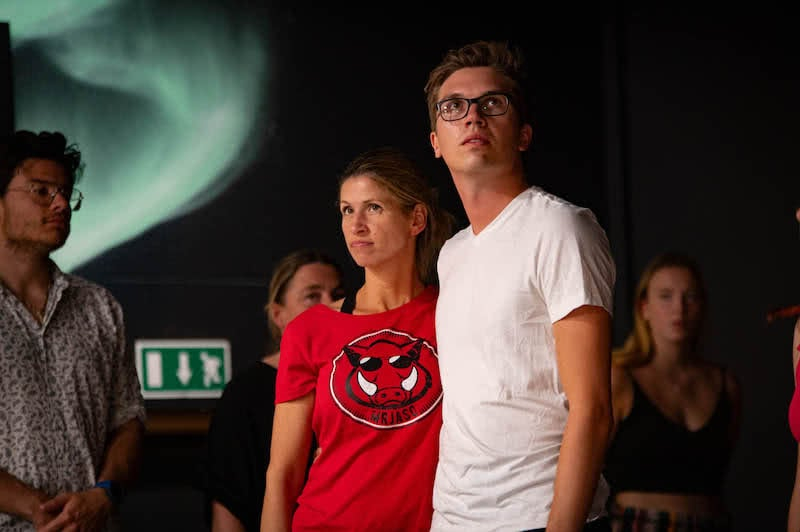
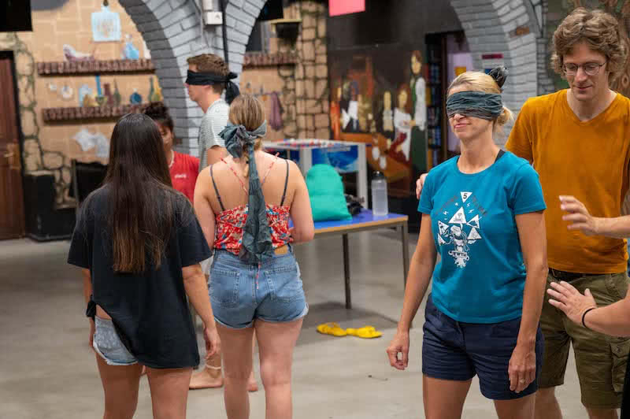
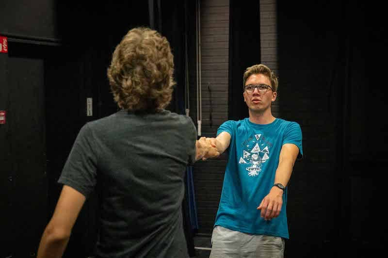
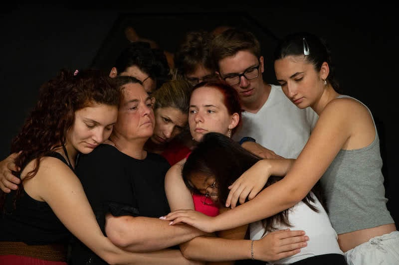
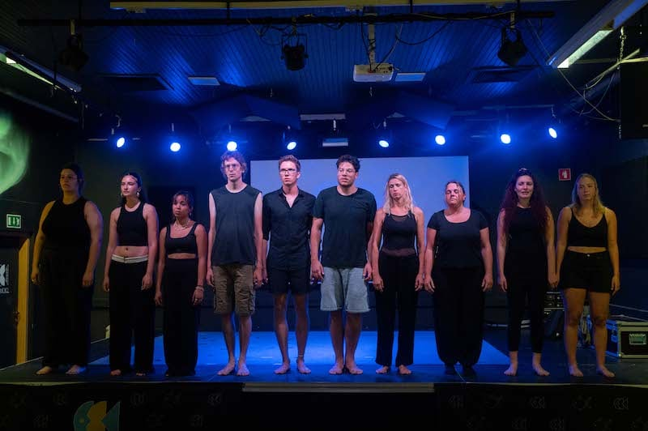
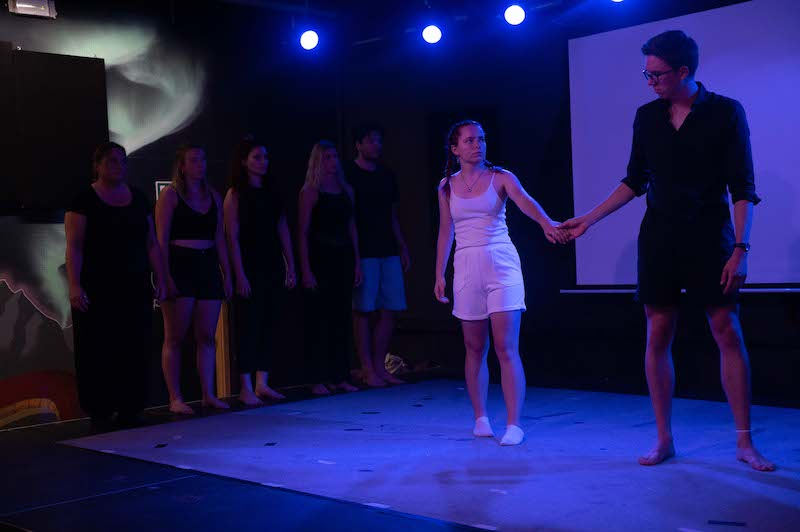
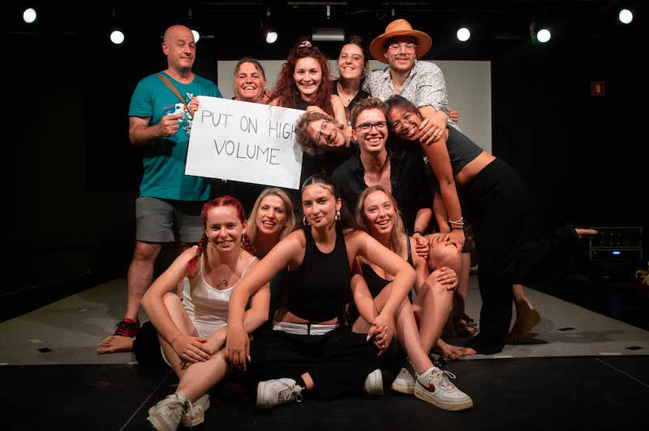

In a fusion of wanderlust, theatrical prowess, and the immersive spirit of Erasmus+, I found myself embarking on an unforgettable journey known as Future Telling.

As fate would have it, an ordinary scroll through my Instagram feed led me to a post that lit a spark within me:

>"Ready to spend a transformative week among like-minded theatre souls hailing from every corner of Europe? Join us for Future Telling!"

Without overthinking, I peeked at my remaining vacation days and followed my gut to sign up. And, oh boy, the workshops were like a buffet – but with a twist, you have to commit to one dish for the whole week. I went all in on 'From Idea to Creation' by the mysteriously cool Halil Itzhak from Israel. 

Fast-forward to the crack of dawn, and the Karlsruhe squad – armed with enough snacks and socks to survive a theatrical apocalypse – gathered. We rendezvoused with the rest of the crew in Stuttgart, and before I knew it, we were on the move. Two trains, a scenic drive through the Alps, and eight hours later, voilà! Koper, Slovenia. A mix of Game of Thrones-esque architecture, Italian culinary wizardry, and a beach that looked ripped out of a travel magazine.

After a cannonball into the water and a first-date-worthy pizza, it was time for the main event – the workshops.

## Day 1: Unleash the Drama!

>Introduce yourself, be open, be free, but answer three questions:  
>1. What are you good at?  
>2. What are you afraid of? 
>3. What is something that you hate about yourself, and want to change?

Talk about diving in deep for a workshop warm-up. We bared our souls faster than you can say 'Future Telling'. The goal? Embrace the mojo of the workshop - find that creative spark deep within. So, we tackled FOMO, spilled relationship beans, and got cozy with imposter syndrome. Sharing these personal stories connected us in a way that felt like we'd known each other for ages. The sharing was so raw, so immediate, that intimacy blossomed in this circle of strangers. And those tears? Well, they were only the first act.

After this soul-baring opening, we dived into some acting basics. You know what's cool? Deciding to do something because your partner actually did something – it's like improv on steroids. Amid the shared giggles, I realized this: being human means connecting, making conscious decisions, and sharing actions.

As the sun set, the international party was just getting started. We reconnected with the other workshop people, hit the beach, explored the town, and had a blast discovering each other's quirks.

## Day 2: Blindfolded Trust and Senses Anew
You can't spell "connection" without trust, right? And guess what the secret trust-building ingredient is? Blindfolds! We started with a blindfolded huddle, and let me tell you, it's like a sensory puzzle where everyone's wearing a blindfold. A it awkward, but super fun!

Next, the blindfold extravaganza levelled up. We went from "I can't see" to "I can't see AND I'm touching strangers." And oh boy, did we bond. Immediately the feeling of isolation in the turned into the opposite, into eagerness to explore. But the pièce de résistance? Navigating the city blindfolded for half an hour, led by a partner for half an hour. It was an epic sensory overload – smells, sounds, and even a surprise rendezvous with scorching-hot asphalt. A lesson learned: theatere is more than just seeing and talking; it's feeling, touching, smelling – a whole circus of senses.

On that day, I stumbled into a truth stranger than fiction – just when I thought it was safe to take a breather, the workshop threw me another curveball. It was as if life was conspiring with Halil to keep me on the edge of my comfort zone. After our urban escapade, we returned, half-exhausted and half-ecstatic. Halil, ever the puppet master, laid it out plain and simple: "Create a short farewell video for a close friend who has taken their own life."

Imagine that – a room full of near-strangers suddenly tasked with crafting poignant, heart-wrenching farewells for imaginary friends who met an untimely end. Talk about a mood swing! Amid the nervous laughter and uncomfortable glances, it dawned on us that this was theatre delving into the darkest corners of our hearts, demanding authenticity in the most chilling way. So as I reconnected with the rest and more beach, I spent the evening pondering the task.

Allow me to unveil "THE FOUNTAIN" – a breathtaking marvel nestled within the heart of the city park. Picture this: every hour, the waters erupt into a symphony of liquid melodies, a dance orchestrated by the very spirit of aqua. And if the legends are true, it's practically encoded in the DNA of Future Tellers like us to plunge into its watery embrace. Yep, just like the adventurers who came before, we too couldn't resist the siren call, leaping in with the grace of exuberant kids, ready to stage a 20-minute spectacle of expressive aqua-dance extravagance.
Each evening, as the clock approached the appointed hour, anticipation would crackle in the air like electricity, igniting our inner performers. The park would become our theater, the fountain our stage, and the aquatic choreography a language unspoken yet universally understood. 

## Day 3 - Blindfolds, Burek, and Emotional Rollercoasters
Fuelled by a buttery Burek courtesy of a quick bakery dash (Slovenian breakfast? White bread and musli, of course! Not my jam.), I embarked on a frantic mission. Balancing a piece of Burek like it held the secrets to the universe, I perched on a staircase, contorting myself to capture emotions on camera while chomping away. The result? A true masterpiece – an unedited, unfiltered one-take burst of feeling that flowed out like a cosmic monologue.

Back in the workshop, it was a rendezvous with blindfolds yet again. Brace yourselves for the "Tear-Soaked Dream Odyssey." Our journey through this quest kicked off in our happy place – home sweet home. From there, it became a rollercoaster ride through the tapestry of emotions. Loneliness, mockery, dreams, losing them, giving and receiving love, heartbreaks, and facing solitude once more. And believe you me, it involved blindfolds transformed into sob-soaked sponges and shirts turned into tear-drenched canvases over the course of a sob-tastic hour.

After a breather – much needed to mop up our emotional mess – we dove headfirst into creation mode. Now, this was a one-of-a-kind creative storm. Step one: huddle up in teams and spill the beans on a life-altering decision. Then, grab a random object and turn it into a mesmerizing stage spectacle. No words allowed – only music as your expressive partner.

In my quirky little troupe, an unexpected theme emerged. We were all onboard the "What If" train, but deep down, we bet our bets on ending up exactly where we were meant to be. Cue our grand performance – a choreographed ode to sameness, decisions, and the cyclical nature of returning.

The magic was real as the room came alive with quirky interpretations of raw emotions. Other groups' performances bore the flag of honesty, flying high with motifs of alienation, longing, and the sensation of life as a bemused bystander.

In the end, the day left me feeling like I'd been on an emotional rollercoaster that tossed me from tears to laughter, all while blindfolded and clutching a piece of pastry. And weirdly, that's exactly where I needed to be – in the thick of the strange, the uncomfortable, and the uproarious, because that's where true theatre and life intertwine.

Again the day closed with a surprise video task. This time we waltzed into our creative arena with a mischievous grin. "Time to put on your best mask," it seemed to say, challenging us to master the art of theatrical double takes – faking happiness, but showing that it is fake.

While finding my confidence to create another video - I can't seem to loose the awkardness of seeing and hearing myself - the sun began its evening descent, a renewed mission beckoned – "Fountain Time." The mandate was as clear as a drop of dew – seize the fountain's aquatic stage again.

## Day 4 - Echoes of Creation
As the sun danced its ascent, Day 4 of our theatrical escapade unfolded, an echo of the creative cadence we'd embraced. If there was one thing we were growing accustomed to, it was the rhythm of exploration, expression, and connection.

The day was a symphony of introspection, of peering beyond the obvious and diving into the depths of our unresolved dilemmas. The first question, an emotional breadcrumb for our minds, probed into our unhealed wounds – those bits of life's puzzle that resist tidy resolution. And it struck me that life, like theatre, often spins us in cycles, looping us through themes and lessons again and again until we finally face them with open hearts.

And so, with a rope symbolizing our boundaries and inhibitions, we walk that fine line between daring and overstepping. Our performance was a dance of courage.As our bodies moved, a subtext emerged - a story of bonds in need of repair, of lines begging to be redrawn.

But then, like a soft sigh, the second question hung in the air: What are you afraid of? A question that sent ripples through my soul. As my mind wandered into the realm of fears unspoken, I recognized the familiar tango between apprehension and courage. There we were, facing our fears once again.

## Day 5 - Unveiling Limits and Reimagining Freedom
Day 5 kicked off with a trusty Burek boost, setting the tone for what was to come. Little did I know, it was going to be a day of surprises and realizations, each turn packing its own punch.

"What's the point?" This question tiptoed through my thoughts, casting a shadow over the familiarity of our routine. Were we merely traversing a loop, a circle of similar challenges with different flavors, but all emotionally heartbreaking? An unresolved echo whispered, taunting the sense of purpose that had guided me so far. Getting caught up in heady talk wasn't the path I needed today – I was seeking a connection to myself, to what I felt deep inside. Combine this with emotional exhaustion of the past days hitting hard, and you get my impromptu solo timeout. Amidst the whirlwind of emotions, I found myself craving a moment to regroup and reflect alone. Something that I had not allowed myself to have - hello again trusted friend FOMO.

As the day progressed on, a chat with Halil, my workshop leader unfolded as a lesson in self-discovery. I stumbled upon a surprising truth – as much as I loved the idea of unbridled freedom, it has always been the constraints that spurred my creativity.

In an other playful twist, a task to reintroduce ourselves gave me a chance to step into this restriction and my scientist persona. Armed with curiosity, I conducted a little experiment. If I am many and only a limited construct of what other project in me – asking others for a single word to describe me is the best way to describe myself. The result? A mirror of adjectives reflecting both my friendly vibe and my rough edges.

The day wrapped up with us finally starting to put the puzzle together - a performance that wove together all the stories we'd shared. Directed by Halil and using our videos and previous performances we started creating an exploration of the digital landscape's influence on human emotions, an compelling montage that showed how the virtual world tinkers with real-life struggles.

## Day 6 - Grand Finales and Bittersweet Goodbyes
Day 6 unfolded with a crescendo of energy as we meticulously rehearsed our performances. Each time we seemed to tip-toe on the brink of emotional exhaustion, a testament to the depth we had ventured into on this journey.

Then came a welcome respite – a half-day off, a chance to let the week's experiences sink in, to feel the impact of it all coursing through my veins. As I stepped back from the whirlwind, the enormity of the past week's intensity hit me – every emotion, every connection, every revelation. It left me pondering how to carry this vibrancy into the mundanity of everday life.

In this seemingly repetitive dance of introspection and expression of the week, I discovered the heartbeat of the human experience. We circle back, not to relive the same scenes, but to peel back the layers, to find fresh nuances, to seek growth even in the familiar. The point, it seemed, was not to avoid the echoes, but to find the new harmonies they hold – a lesson whispered through the rhythms of creation, expression, and self-discovery.

The performances took center stage, a mosaic of creativity and emotion woven by each workshop. As we watched each group take the spotlight, differences, references and similarities unfolded. In our performance a cacophony of mobile notifications echoing through the air, seamlessly melding the realms of the digital and the tangible. Within this fusion of spaces lay a profound revelation: the unconnected connectedness that life. It was a tapestry woven from disparate threads, each thread a testament to the human experience. From the deceptive facade of happiness, to the numbing of Decision Anxiety and the dismal release in letting Go, it all coalesced into a symphony of emotions. And at its core, a powerful pulse resonated — a stark exploration of the shadowed reality of suicide, a somber nod to the intricacies of life that often remain unspoken.

And then, the day segued into a burek-powered party – a finale punctuated by lasts and goodbyes. Laughter echoed as we danced in the fountain, dipped into the sea, and basked in the sweetness of the moment. Amid the cheer, there lingered a twinge of bittersweet, the knowledge that this chapter was coming to an end.

As the sun set on this remarkable week, I found myself grappling with a whirlwind of emotions, ready to face the world with more depth and sincerity, to infuse my days with the same vigor, the same human connection that had coursed through every second of this theatrical odyssey.

## Epilogue: The Theatrical Odyssey of a Lifetime
From the moment I stumbled upon that Instagram post, my life took a thrilling detour into the world of Future Telling – a week-long rollercoaster of emotions, self-discovery, and boundless creativity.

Set against backdrop of charming Koper, Slovenia, I journeyed alongside like-minded theatre enthusiasts from across Europe. We delved into workshops that pushed our boundaries, laying bare our fears, hopes, and vulnerabilities. We bared our souls in conversations that blurred the lines between strangers and friends. We dived into the depths of emotion, grappling with questions that tested our resilience and understanding. I found solace in solitude, embraced the power of vulnerability, and realized that creativity often thrives within the confines of constraint. As we danced with happiness and faked it with courage, we unearthed the profound power of empathy and the complexity of the emotional mess that is being human.

As the final curtain falls on this unforgettable journey of Future Telling, my heart sways between the sweet nostalgia of cherished moments and the tang of impending goodbyes. The friendships forged through vulnerability – they're etched in my memory like scenes from a beloved play. And yet, as I contemplate the prospect of next year's encore (maybe as a participant maybe as a workshop leader), a flicker of anxiety dances within me. I'm afraid, that the weight of expectation, the projection of how it should be, might tint the vibrant hues of this week. The magic we've woven here thrives in the spontaneity of the present, and I wonder if attempting to recreate it might inadvertently dim its sparkle. For now, I hold these memories close, grateful for the journey, and uncertain, like the flutter of a curtain caught in a gentle breeze, about what the next act might hold.

>Life is a series of what if, of missed connections. 
>But our choices make us who we are. 
>Letting go of control and thereby gaining control. 
>Relaxing into the tension of the uncomfortable. 
>Tiptoe to find safe ground but still burning my toes. 
>Realize that reality is always unrealistic. 
>For if I give it all, I may end up empty. 
>but if I don't give everything, then I can never know what I am given. 
>I alone am the master of my destiny.

