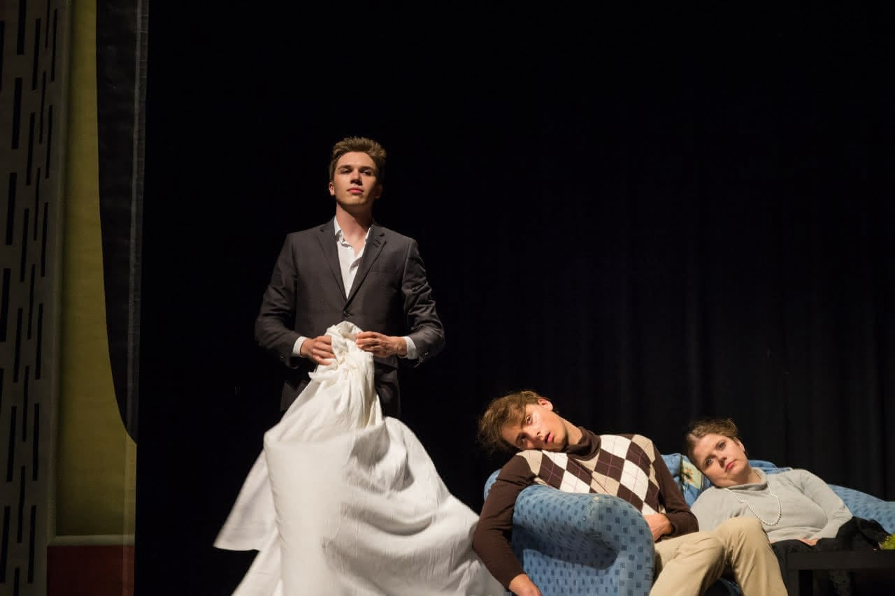

I was never a real theatre kid in school. So why am I so obsessed with theatre now? 

To say I was not a theatre kid is not completely honest. Truth is I was on stage for two school musicals, but that was purely based on me being in the school choir. My school also had a small theatre, but I was not on stage there but active behind the scenes in lighting and sound.
After I finished school and started studying in Karlsruhe everybody I meet had done more or bigger shows or was even working for some event tech company. 
So I decided no more theatre for me. 

# Loriotesk!
After a two year hiatus, I was approached by a friend of mine, who asked me if I am interested in playing theatre. He thought I was a funny guy so he guessed comedy might suit me. I did not take me much to say yes so a couple of weeks later we, a team of six, went on to develop a play made up of Loriot pieces, directed and played by us. 
We completely reinterpreted and connected these broadly known sketches to tell a hilarious story of failing relationships, boredom, and media.
So say at least I was hooked now. Immediately after playing the last show I went on to the next one.

 *Loriotesk: The TV is not why our relationship is in shambles*

# Jugend Ohne Gott / The Age of Fishes
The Age of Fishes was my first project with the Junges Staatstheater Karlsruhe and was directed by [Jakob Weiss](https://jakobweiss.de/). In this play, I was part of the speaking choir of pupils. The Age of Fishes by Horváth tells the story of a teacher and his fascist students.
The Teacher is confronted with the unreflected ideology of the dictatorial system when the conflicts seething in camp get out of control and a murder is committed. This play depicts the coldness and mendacity of a fascist society, in which a lost youth grows up without freedom and ideals. The teacher's questions about responsibility, morality and the necessity of one's actions are more urgent today. 
 *The teacher and his students in Age of Fishes (Photo: Felix Grünschloß)*

I was on stage for this piece over 30 times, while it was seen by more than 3000 viewers, including a guest performance in Pakistan. After many shows, I had the chance to discuss the topics of this piece and theatre in general with the viewers. To share my love and understanding regarding theatre as a living construct with visiting pupils meant a lot to me. This play, in combination with daily news and stories of senior visitors about their experiences with fascist systems, showed me the analogies to the more than one current event in Germany. This was alarming.
Being on stage in this production thought me about group dynamics not only concerning fascist regimes but also in reflection on my daily life. It is so easy to get hooked on something or someone if they are just loud enough. Once you are with the bigger group, no matter what the topic is, you immediately feel empowered. 
Theatre is a safe space were these extreme topics can be discussed. While the play looks brutal and martial from an outside perspective backstage the atmosphere is very relaxed and positive. Maintaining the same quality of the speaking choir with changing cast needs very high empathy for the other actors and concentration on every single performance.

# Woyzeck
Woyzeck was a production directed by Manuel Schüler with twelve young actors from Karlsruhe. Woyzeck is a German classic written by Georg Büchner. Woyzeck is a young soldier who lives with his wife Marie and their child. With immense pressure coming not only from medical experiments but also from his peers and society makes his mental health deteriorates throughout this play.

I portrayed the Hauptmann, Woyzecks Chief, who is regularly shaved by him and also puts sexual pressure on him. 
Working on this role was challenging especially with a very short time for rehearsals. This play contained complex motives of oppression, mania and complicated relationships. Therefore a lot of character work and sensitivity were required to portrait this character naturally and truthfully. Getting an outside perspective is very unusual but Theater can be a way to learn how you appear to others.

# tick, tick... BOOM!
tick, tick... BOOM! is a rock musical by the American Tony Award Winner and Pulitzer awardee Jonathan Larsons.

Over the time of almost two years, I developed and managed this project as a project lead and dramaturg. This musical consisted of a team of over 20 volunteers, including technicians, band, director and scenery. It was a tremendous challenge to bring (and keep) together this team of diverse people from different backgrounds. Producing theatre means that everything and everyone has to come together perfectly and at the same time. 

The story hits the heart of my generation: 
Jon, an aspiring composer. Jon is on the edge of turning thirty and worries that he has made the wrong career choices. He tries to write music for a living but is not successful. His best friend since childhood Michael gave up arts and now has a lucrative marketing job and his girlfriend Susan wants to move away from New York for a better job. 
Jon sees turning thirty as the *"end of youth"* and must decide between his passion and being successful. 

 *Jon and Micheal throwing paper over the band (Photo: Ramona Just)*
> Cages or Wings, which do you prefer?

# Honiefaith
In the third height (?) of the Corona-Pandemic I was asked to direct the European Premiere of Honiefaith by Monty DiPietro. Honiefaith explores the shadowy world of Japanese "hostess clubs" through the eyes of the foreign women who work there.

 *Reporter Balmori uncovers more of the background of the murder (Photo: T. Schlinck)*

When a Filipino hostess‘ dismembered body is discovered in a locker in Tokio, journalist Victor Balmori is thrown into this turbulent scene. During his investigations, Balmori is confronted with the peculiarities of the Japanese police system and the everyday racism in Japan, Balmori is looking for a story, but he finds a nightmare.

# Improtheater Karlsruhe
The [Improtheater Karlsruhe](https://www.improtheater-karlsruhe.com/) is my current and happy theatre home. Together with a diverse cast of faboulous individuals we teach, train and present this art of spontanous creation. Improvisation is a lot. It not only is a great way to learn about yourself and others by listening being present in an environemn of trust and vulnerability. I think it is the spearhead of learning to lead and to follow..

 *Performance with the Improtheater Karlsruhe (Photo: Arthur Leon)*

# Education
Since theater helps me a lot to develop my personal and interpersonal skills, I want to pass on my experiences as much as possible. I am passionate about giving people a safe space to learn about themselves and others. 
The UniTheater Karlsruhe conducts weekly workshops with a different topic every week. I had the opportunity to give multiple workshops for this format including topics like improvisation, directing, singing & speaking and mindfulness. I still get surprised about the tremendous impact some tips or an exercise can have on someone.

To learn more about how to lead theatre groups I regularly go to workshops by theatre professionals. I love to share my experiences with other students.
I still regulary train and support other in both directing and acting. My current focus is on phyisical theatre and the use of the body as a tool for expression. 

 *Workshop at the UniTheater Karlsruhe*

My personal directing style is naturalistic, fast, physical and expressive.