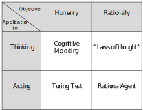

[TOC]

The Lecture Artificial Intelligence in Service Systems consists of an intro in the basics of Machine Learning while focusing on the full lifecycle of a machine learning systems both in one-entity use cases and in service systems. 
An additional exercise provides hands-on experience in working with data and training basic algorithms.
One has to pass four out of six homework assignments to be admitted to the final exam. I would recommend this lecture to anyone wanting a gentle introduction and an overview of the basic concepts of AI.

## Introduction
* AI is "In" right now, because *data is available*, *business need for automation* and the capabilities both in terms of *hardware* and *machine learning technology*.
### Machine Learning
#### Overview of terminology

*A basic overview of terms in and around from Machine Learning and AI according to [@kuehl2019]*
#### Classification of AI-based on Objective
There are different research currents, that can be classified by the objective and kind of decision making of the AI.

Source: [@@russel2009]

* *Cognitive Modeling* (human-like thinking): AIs should follow the same reasoning as Humans
* *Laws of Thought*  (i.e. thinking rationally): An AI is required to arrive at the rational decision despite what a human might answer.
* *Turing Test* (i.e. acting humanly): An AI must act intelligently when interacting with humans. To accomplish these tasks, an AI must perform human tasks at least as good as humans. These requirements can be tested by the Turing Test.
* *Rational Agent*: An AI acts as a rational or intelligent agent. This agent does not only act autonomously but also with the objective to achieve the rationally ideal outcome.

#### PEAS Modell
An AI system model consists of an agent and their environment.
It perceives the environment by sensors (e.g. camera) and acts upon it by actuators (e.g. robot arm).  
The PEAS Model measures the Agent’s **p**erformance, in an **e**nvironment with **a**ctuators and **s**ensors

#### Levels of AI-based on its intelligence
* Weak AI is good at one specific thing (e.g. image classification)
* Strong AI or Artificial General Intelligence is as good as a human
* Artificial Superintelligence is "much smarter than the best human brains in practically every field, including scientific creativity, general wisdom and social skills" [@@bostrom2014]

> **Self-improvement**: AI is able to create AI and thus improve itself, leading to a super-exponential acceleration of its abilities

#### How systems learn
* The agents increases its performance on *future* task, this process is called Machine Learning
* Improvements are made by observing the world and adjusting future decision accordingly
* Knowledge of the agent is represented as the already learned information

#### supervised vs. unsupervised learning
* supervised learns the mapping from the input to the output
    * Typical: regression / classification
* unsupervised learning identifies previously unknown patterns in data
    * Typical: clustering / association rules

#### Layers of an Agent

The processing of sensor data and control happens in the Frontend, which is the agent's only link to the environment. Machine Learnings powers the Executing Backend - which executes the model in inference - and the Learning Backend which builds/updates the model.
Agents are differentiated whether they learn only once (= *Simple Reflex Agent*) or their model is updated continuously (= *Learning Agent*). [@@russel2009]
### Service Systems
> Service providers and service clients working together to co-produce value in complex value chains or networks<cite>&mdash; [@@tien2003]</cite>

## Initiation
### Problem Understanding 
Problem Statement

1. Set objectives from a business perspective
2. Define business success criteria (When is this project successful? Make it specific and measurable)
3. Translate Business Case to Machine Learning Problem (Classification vs. Regression) 

### Data Gathering
#### Types of Storage
* **structured data** - stored in relational database e.g. SQL (~5-10% of all data)
* **semi-structures data** -  structured but not in relational database e.g CSV, JSON
* **unstructed data** - no structure (~80%), might needs to be combined with other sources
#### Types of Data
* static, batch data
* streaming real-time data (e.g. time series data)
&rarr; Labeling by humans might be neccesary
#### Sampling
> the selection of a representative subset 

* **Random Sampling** - same probability for each data point
* **Systematic Sampling** - ordered data, random start point but points of a specific distance (e.g. every 4th point)
* **stratified sampling** - group data in categories (=strata), randomly select data from each cluster
* **cluster sampling** - cluster data, select clusters to include randomly
[@@tille2011]

#### Data Distribution
Explore the Data Distribution, to select the right algorithm and for correct evaluation of the models.

* Sparsity - Describes how many zeros the data contains (more zeros = sparser data)
* Noise - random error (e.g. transmission problems)
* Imbalances - Little Data for one class

#### Data Quality
> Garbage in, Garbage Out (GIGO) 
> &mdash; <cite>George Fuechsel</cite>

The six Dimension of data quality assessment according to [@askam2013]

* **Completeness** – all data recorded
* **Uniqueness** – no duplicates
* **Timeliness** – recent data
* **Validity** – data follows predefined rules
* **Accuracy** – data reflects the data set
* **Consistency** – data can be matched across data stores

Data Quality has to measured related to the underlying business problem of the previous step (e.g. Data can be complete but not suitable for the problem)

#### Data Preprocessing
* **Smoothing** - Reduce the impact of outliers by giving them a lower weight, Reduces Noise
* **Normalizing** - transforming ranges of different attributes into one

##### Text
* Tokenization - splitting text into words
* Stemming - reduce words to stem (root form)
* Lemmatization - stemming but look up the word in a dictionary
* Part-of-speech - identify grammatical classes
* Removal or Substitution - remove unimportant features
* N-Grams - group words by co-occurring
* Addition/Substitution of synsets (=*syn*onym *sets*) and hypernyms (same semantic field)

&rarr; Bag-of-Words transformation (no order or grammar just multiplicity)

##### Time

* Replacement of missing values
    * Use value neighbor value (previous or after missing value)
    * Use mean
* Time series representation 
    * Sampling
    * Average
    * Linear interpolation
    * Only important points such as minima and maxima
    * Symbolic representation
    * **PCA**: create a new feature from a correlated feature, which is uncorrelated by data projection
* Alignment
    * Simple alignment methods 
    * Indicator variable
    * Correlation Optimized Warping 
    * Dynamic Time Warping [@@berndt1994using] - matching based on similarity

### Feature Engineering
Use an existing feature to create new ones.
#### Numerical Data
* Raw
* Basic Statistical measures (e.g. min, max)
* Binarization - Reduce feature to one or zero
* Rounding - Reduce Precision
* Binning - fixed width or adaptive binning
* Monotonic - e.g. log

#### Categorical
* Transformation - catergorical to numbers for nominal (no order) or ordinal (orderered)
* Encoding
  * One-hot-Encoding - n distinct labels to n binary features (1s for has a label)
  * Dummy-Coding - n distinct labels to n-1 binary feature, one label is zero vector
* Feature hashing - hashing is useful for a large number of categories

#### Automatic Feature Engineering 
Python: [Featuretools](https://www.featuretools.com/)  

* Deep Feature synthesis - stack primitive calculations

## Performance estimation & evaluation
Split Data into training and test data. The model learns from the training set and is evaluated with the test set.

### Classic Machine Learning Methods
* (Multiple) Linear Regression - $Y=\beta_0+\sum^{i}_{i=0} \beta_i X_i + \epsilon$ with $i$  the number of features ($i=1$ for simple - one feature - linear Regression) and $\epsilon$ as error. $\beta_i$ is calculated by the least-squares approach.
* Random Forest - Built model from bootstrapped decisions trees
    * Decision trees: Each node of the tree is a feature-wise split and each leaf for an output $Y$
* [Naïve Bayes](https://scikit-learn.org/stable/modules/naive_bayes.html) - Estimate the underlying probability distribution (e.g. Gaussian) $Y = arg max P(Y) \prod P(X|Y)$. Naïve meaning that the features are conditional independent (meaning statistically independent and contributing independently to the probability of the class)
* Support Vector Machines (SVM) - Hyperplane to separate instances. One-versus-One or One-Versus-All Classification. Different Kernel can separate different (non-linear) data distributions.
### Artificial Neuronal Networks
* The idea of Artificial Neuronal Networks is to mimic the brain or brain cell connection, by connecting artificial neurons. Neuron weights the inputs and sends them to the next connected neuron(s).
* Training fits the weights of each neuron. 
* Layers: input - hidden (might be multiple) - output
#### Convolutional neural networks (CNN)
CNNs are used for analyzing visual images.  
Layers can be one of the three:     

* Convolution - reducing the number of parameters by convolving the input
* Pooling - extracting dominant feature
* Fully Connected - each neuron is connected to the next layer
#### Recurrent neural networks (RNN)
The output of a neuron is used as an additional input of a neuron. Therefore the network can learn the order of the data.  

* Direct Feedback - own output as additional input
* Indirect Feedback - Input is sent to a neuron of the previous hidden layer
* Lateral Feedback - Output is sent to neurons on the same layer
* Full Feedback - Neuron is connected to all other neurons

#### Long short term memory network (LSTM)
A subset of RNN with a focus on long-term dependencies.

* Input gate – which values of the cell state are updated
* Output gate –  which part of the cell state will be used for the calculation of the output of the whole cell
* Forget gate – decides which information is removed from the cell state

### Performance Metrics
Metrics are evaluated on the unseen test set!

* Variance $Var(X)=E[(X-E[X])^2]= E[(X-\mu)^2]$ - How scattered are the results?
* Mean absolute error $MAE = \frac{1}{n}\textstyle \sum_{i=1}^n \displaystyle\mid \hat{Y}_i - Y_i \mid$ - average performance
* Root mean squared error $RMSE = \sqrt{\frac{1}{n}\textstyle \sum_{i=1}^n \displaystyle( \hat{Y}_i - Y_i)^2}$ - prediction deviation
* Coefficient of determination $R^2$ - How well can the variance be explained?

* Sensitivity $TPR=\frac{TN}{N}$
* Specificity $TNR=\frac{TN}{N}$
* Precision $PPV=\frac{TP}{TP+FP}$
* Accuracy $ACC= \frac{TP+TN}{P+N}$
* $F_\beta=1+\beta^2 \frac{pecision* recall}{\beta^2 *precision + recall}$ with $\beta$ often in $[1,2,0.5]$

### Evaluation Methods

#### Without parameter optimization
* Percentage Split 
* Cross Validation - Splitting the data into 3 sets of training, test and validation
#### With parameter optimization 
* Global hold-out set - used to test the model
* Nested Cross Validation - inner cross-validation & outer cross-validation

#### [Under-/Oversampling for imbalanced datasets](https://en.wikipedia.org/wiki/Oversampling_and_undersampling_in_data_analysis)
Imbalanced data sets have (a lot) more data samples in one class compared to the other. Therefore the usual metrics might not penalize errors in the minority class as well.

Find more in [@@cawley2010]

* Undersampling the overrepresented class 
* Oversampling the underrepresented class
* SMOTE - Oversample by generating synthetic data points

### Parameter Optimization
* Grid Search - Brute Force parameters. Define value ranges and evaluate each parameter combination 
* Random Search - [@@bergstra2012] 

### Overfitting
Overfitting refers to the model learning the training data very good, but not generalizing enough (by e.g. being to complex) to perform on the test data.

* Global holdout set - Data neither used in training nor while validation
* Nested Cross-validation - Inner cross-validation as usual, add outer cross-validation as a hold-out set
## Deployment
Once the model parameters are set, we use the whole dataset for training the model to receive the best possible results.
### Challenges
* Multiple Languages - Python, R --> API
* Parallel GPU needed --> Cloud
* Upredictable Costs --> Serverless

### Decisions
* SOA (Service-Oriented Architecture) and SOC (Service-Oriented Computing) have services as their fundamental elements that can be rearranged flexibly. 
* Microservices - each one with one specific function

### Deployment Options
Choosing the deployment options based on the abstraction layers you want to outsource

* Docker as a Container Provider
* Kubernetes as a Container Orchestrator

## Concept Drift
The phenomenon of changing data. This can be either due to the environment or the application changing.

$Concept= P(X,y)$  

Concept drift $P_{t0}(X,y) \neq P_{t1}(X,y)$

* Real Concept drift $P(y|X)$ changes
* Virtual drift - $P(X)$ changes

### Challenges
* Detection
* Adapting
* Distinguish drift from noise
* Recognize recurring context
* Operation 
* Label availability (might be only available for some data points or with delay)
### Types of Data Changes
* abrupt
* incremental 
* gradual
* reoccurring concepts
* outliers

### Adaptive Learning

*Overview of Adaptive Learning Methods* [@@vzliobaite2016]

* **Forgetting** by fixed training window (rolling window)
    * Blind Methods (Prediction incrementally adapting)
        * Incremental weight decrease for older observations 
        * CVFDT (Concept-adapting very fast decision trees)
* **Detection** of changes: When change detected drop old data and retrain
    * informed Method (Change Detection & Prediction): Explicitly detecting a change
        * Sequential Analysis: Page-Hinkley [@@gama2013]
        * Monitoring two distributions: ADWIN [@@bifet2007]
* **Dynamic Ensemble** evaluating several models in parallel (via voting or meta-model)
* Contextual identifies the group affiliation to find the best model (good for reoccurring concepts)

## System-wide Learning
Data is isolated in systems, access from other entities is difficult. 
### Challenges
* Data privacy/confidentiality
* Data heterogeneity
* Data velocity / volume

Also, check out the [42 V's of Big Data](https://www.kdnuggets.com/2017/04/42-vs-big-data-data-science.html).

The Big Challenges in a Business context are

* Predicting outcomes based on distributed components
* Training models based on distributed instances
### Predicting outcomes based on distributed components
* Isolated Analysis (no data exchange)
    * `+` no heterogeneous data, less processing complexity 
    * `-` prediction based on incomplete data
* centralized analysis
    * `+` complete information
    * `-` transfer of large dataset (! streaming data), more complexity, heterogeneous data

### Meta-Learning

> A meta-learning system must include a learning subsystem, which adapts with experience.
Experience is gained by exploiting metaknowledge extracted in a previous learning episode on a
single dataset and/or from different domains or problems. <cite>[@@lemke2013]</cite>

With multiple entities this means, each entity trains its classifier with their confidential data and only has to share the outputs to build a cross-entity meta-classifier.
### Base Learner Combination (=Ensemble)
#### Bagging [@@breiman1996]
* data randomly sampled into subsets and subsets used to train  models 
* Increasing of performance by averaging models
* decrease variance
* parallel model
#### Boosting [@@schapire1990]
* data randomly sampled into subsets, *weighing* data with the success of the previous model. Subsets used to train  models 
* Increasing of performance by combining models with *weighted* majority vote
* decrease bias
* sequential model
#### Stacking [@@wolpert1992]
* Output of first level classifiers is used to train a second-level classifier
* Each entity builds their model with their (confidential) data, combining them in a meta-model. The abstract output can be transferred to the meta entity for further holistic analysis. This also reduces the amount of transferred data. 

### Exchanging Predictions and Models (as a Service - aaS)
* Predication-aaS: specific Prediction based on a specific data instance
* Meta-Prediction-aaS: comprehensive Prediction based on distributed data
* Configuration-aaS: configuration recommendation based on data
* Model-aaS: from data to predictive Model (e.g. Googles AutoML)
* Transferred-Model-aaS: improve the existing model with transfer learning on other model or data 
#### Transfer Learning
> *Transfer learning* tries to improve the learning of a new task based on the transfer of
knowledge from a related task that has already been learned. 

Mathematical Definition: 
> Given a source domain $D_S$ and learning task $T_S$, a target domain $D_T$ and learning task
$T_T$, *transfer learning* aims to help improve the learning of the
target predictive function $f_T(\cdot)$ in $D_T$ using the knowledge in
$D_S$ and $T_S$, where $D_S \neq D_T$, or $T_S \neq T_T$.
> <cite>[@@pan2009survey]</cite>

* inductive transfer: induce predictive model for target domain but for different tasks
    * *Self-Taught Learning* [@raina2017selftaught] trains unsupervised on random images to extract features and uses these to train the classifier supervised. (This is not a semi-supervised technique since it does not have the assumption of getting the unlabeled data from the same distribution as the labeled)
    * *Multi-Task Learning* [@ruder2017overview] train multiple problems together with information relevant across tasks and split them later
* transductive transfer: same tasks but labeled data only in the source domain
    * domain adaptation: same content but different domain
    * Sample Selection Bias 
* unsupervised: Utilize transfer for unsupervised learning

### Creative AI
&rarr; See my Post on AI and Creativity (coming soon)

### AI and Ethics
> There are no hard problems, only problems that are hard to a certain level of intelligence. Move the smallest bit upwards [in intelligence] and some problems move from "impossible" to "obvious." Move a substantial degree upwards, and all of them will become obvious.  
> &mdash; <cite>Eliezer Yudkowsky</cite>

With Artificial Intelligence, humanity might face existential risks, e.g. when AI self-improvements get out of hand. Additionally Unemployment and moral questions (e.g. trolley problem by Philippa Foot) have to be considered.

&rarr; Artificial Superintelligence will arrive and its arrival will be sudden.

As a practitioner we should consider *Misuse* (e.g. by surveillance of foreign governments), *Fairness* (e.g. Women are not given a loan), *Transparency* (e.g. does the user know what is done with his/her data) 

#### Bias
An all steps of the process we should be on the lookout for Biases in our data, these include:

* Racial Bias
* Gender Stereotypes
* ...

#### Fairness
Fairness defined both in terms of group fairness, where the fairness across groups (e.g. genders, races) are ensured or individual fairness, where for similar people the same results are produced.

Fairness could be used as an additional constraint for the algorithm but might decrease performance.

#### Human Rights and Robot Rights
Humans are conscious (e.g. feel pain) and self-aware (e.g. aware of the pain), therefore we have human rights. The goal of humans (and their constitutions) is to minimize suffering (or prevent it)

&rarr; So what happens when a system becomes self-aware and can it feel pain? 