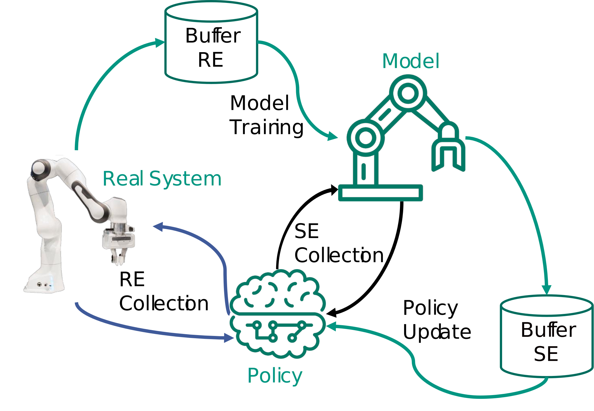

[TOC]

!!! warning
    This document is part of my exam preparation and therefore still work in progress. Handle with care!

## Semi-Supervised Learning
The higher the [Vapnik-Chervonenkis-Dimension](https://en.wikipedia.org/wiki/Vapnik%E2%80%93Chervonenkis_dimension) and therefore the capacity of a classifier the more samples are needed for training.

**Definition**: For Semi-supervised Learning some data is labeled, but most is not.   

**Motivation**: Labeled Data is hard to get and expensive, while unlabeled is easy and cheap.

* *Smoothness Assumption*: The label for two data instances that are "close" to each other and in a dense cluster should be similar.
* *Cluster assumption*: Data instances in the same cluster tend to have the same label.
* *Manifold Assumption*: high dimensional data can be represented by a lower-dimensional representation. [Learn More](https://stats.stackexchange.com/questions/66939/what-is-the-manifold-assumption-in-semi-supervised-learning) 

Semi-supervised learning extends

* Supervised learning with information about the data distribution 
* Unsupervised learning with information and restrictions about the cluster distribution

$\rightarrow$ Goal is to get a better hypothesis than without semi-supervised learning. This means be better than unsupervised learning with all unlabeled data and supervised learning with labeled data.

### Self-Learning (or Self-Training, Self-Labeling, Decision-directed learning)
1. Train with labeled data
2. Predict unlabeled data
3. Add unlabeled data with predicted labels based on 
      * Confidence of the prediction (if over threshold)
      * All Data
      * Weighted with the confidence of the prediction (must be supported by learner e.g. AdaBoost)  
4. Go to Step 1

Can wrap most supervised algorithms. 
The issue is that early but wrong decisions influence the whole process negatively. (Solution: Relabel data if confidence is under threshold)

### Co-Learning [@blum1998combining]
1. Split feature vector into two disjunct feature spaces ("Feature Split"). Ideally these are naturally splittable
2. Train classifier on each labeled feature subset
3. Predict data label
4. Add data with high confidence to the respective other data set
     * Use democratic voting for more than two classifiers
     * Only when a threshold is reached
     * Weighted based on confidence
5. Retrain model(s) with the new data

*Fake Feature Split* to split data that is not "naturally" splittable  
*Multi-View Learning*: No split, but voting of multiple classifiers (similar to Ensemble)  
*CO-EM* use all data, use classifier probability to weight the data.

### Generative Probabilistic Models
Generative Probabilistic Model try to estimate the distribution $p(x,y|\theta)$ of data based on the class. Learning in this context means iterativly optimizing the parameter-set $\theta$ which is different depending on the choosen distribution. (e.g. for Gaussian $\theta= \{p(y_1),p(y_2),\mu_1, \mu_2,\Sigma_1,\Sigma_2\}$ with $\pi_i=p(y_i)$ the a-priori class probability, $\mu$ the mean, and $\Sigma$ the covariant matrix).
#### Expectation-Maximization (EM) Algorithm 
1. Define model $p(x,y|\theta)$ based on the labeled data
2. E-Step: Predict class for unlabeled samples (soft labeling)
3. M-Step: Maximize prediction by updating the parameter vector $\theta$ with all (including newly labeled data)

This is a subset of self-learning and will converge to a local (not global!) maximum. 
If the fundamental assumption of the underlying distribution is wrong, then this will fail, too.
Expectation-Maximization can be extended by Gaussian Mixture per Class or weighting unlabeled data with a factor below one. 

### Low-Density Separation 
SVM goal according to Vapnik: Split with maximum margin to all classes and split in a low-density region.
#### Basics SVM
* **Loss Function** $l(h(\vec{x} | \vec{w}), y)$: distance between hypothesis and label.
* Approximation of **Loss**: $E_{e m p}(\vec{w})=\frac{1}{N} \sum_{i=1}^{N}\left(y_{i}-h(\overrightarrow{x_{i}} | \vec{w})\right)^{2}$ with Quadratic Loss Function.   
* We are interested in the **real error** $E_{real}(\vec{w})=\int l(h(\vec{x} | \vec{w}), y) p(\vec{x}, y) d x d y$, that can only be approximated, since $p(\vec{x},y)$ the actual distribution of the data is unknown. 
$\rightarrow$ Goal is to find a Hyperplane $\{\vec{x} \in S \mid \vec{w} \vec{x}+b=0,(\vec{w}, b) \in S \times R\}$ that maximizes the margin.

#### Lagrage
By using the Lagrage Method we can solve this optimization problem  

* Lagrage Method $L_{P}=L(\vec{w}, b, \vec{\alpha})=\frac{1}{2}|\vec{w}|^{2}-\sum_{i=1}^{n} \alpha_{i}\left(y_{i}\left(\vec{w} \vec{x}_{i}+b\right)-1\right)$
* most $\alpha_i=0$, only the support vectors $\vec{x}_i$ have $\alpha_i>0$ and therefore influence the optimization
* therefore $\vec{w}$ is a linear combination of the support vectors $\vec{x}_i$ $\vec{w}=\sum_{i=1}^{n} \alpha_{i} y_{i} \vec{x}_{i}$

#### Soft Margin
Extend support vector machines for use in nonlinearly separable data with Soft Margin. Soft Margin allows some misclassifications.

* with Soft Margin: $\min _{w, b, \xi_{i}} \frac{1}{2}|\vec{w}|^{2}+C\left(\sum_{i=1}^{n} \xi_{i}\right)^{p}$ with $\xi$ the slack variables and $C$ the regulazation parameter. This is constrained by $\xi_i>0$ and $y_{i}\left(\vec{w} \vec{x}_{i}+b\right) \geq 1-\xi_{i}$ (meaning mostly correct classification)

#### Optimization Problem for Semi-Supervised learning
By introducing the Hinge Function $(x)_{+}=\max (x, 0)$ we can reformulate  the optimization problem to $\min _{\vec{w}, b} \frac{1}{2}|\vec{w}|^{2}+C_{1}\left(\sum_{i=1}^{l}\left(1-y_{i} f(\vec{x_{i}})\right)_{+}\right) +C_{2}\left(\sum_{i=l+1}^{n}(1-|f(\overrightarrow{x_{i}})|)_{+}\right)$. Introducing a  second term for optimizing for unlabled data [@@bennett1999semi]. Solving this optimization problem will lead to a seperation, were there are no (or little ) data. So in an area with low density.

For imbalanced data sets, most Data might be classified as one class.  This can be solved by an additional constraint $\frac{1}{n-l} \sum_{i=l+1}^{n} f(\overrightarrow{x_{i}})=\frac{1}{l} \sum_{i=1}^{l} y_{i}$, meaning that the number of labels for both classes should be similiar. 


#### $SVM^{light}$ 
1. Train SVM with labeled data
2. Soft Label unlabeled Data
3. Iteratively use the optimization formula to relabel the unlabeled data point while increasing loss ($C_2$) of unlabeled for each step. Relabeling is based on the switchability of a data sample. Meaning only if the loss after the switch is less than before switching is done.

#### $S^3VM$
Interprets the distance between seperation and data point as a probability. $\mathrm{p}(\mathrm{y} \mid \vec{z}, \vec{w}, b)=\frac{1}{1+\mathrm{e}^{-y f(\vec{z})}}$ with $f(\vec{z})=\vec{w} \vec{z}+b$
The new optimization problem $\min _{\bar{w}, b} \sum_{i=1}^{n} \log \left(1+\mathrm{e}^{-y_{i} f(\overrightarrow{x_{i}})}\right)+\lambda_{1}|\vec{w}|^{2}+\lambda_{2} \sum_{j=l+1}^{l+u} H\left(\frac{1}{1+e^{-f(\overrightarrow{x_{j}})}}\right)$ uses $H$ the Entropy for regularization

#### Conclusion 
* Optimization is more complex due to the optimization problem being non-convex
* Can have local minima
* Can fail if the base assumption of "separation is in the low-density area" is untrue
Source: [@@bennett1999semi]


## Active Learning
Learning Machine selects some extra data that is labeled by an oracle (e.g. a human annotator as a "human in the loop"). There are different types of approaches as described by [@settles2009active]. Active Learning builts both a labeled data set and a learning machine with each iteration.

*Query Synthesis* The learning machine generates a synthetic query (feature vector) and gets a label from an oracle.

*Selective Sampling* [@@atlas1990training]. The learning machines select samples from a data stream, minimizing the cost of both "seeing a label" and classifying correctly.

1. Define Insecurity Region
2. Monitor Samples
3. Query samples that are in the insecurity region
4. Learn & Reiterate

*Pool based Sampling* [@@lewis1994sequential]. The learning machine draws queries based on some informativeness measure.

1. Measure informativeness/insecurity for all samples and rank them
2. Query human/oracle for top k samples
3. Learn & Reiterate

### Insecurity Measures
The learning machine should select the data points, where it has the highest uncertainty. This means were the prediciton is least confident. $x_{L C}^{*}=\underset{x}{\operatorname{argmax}} 1-P_{\theta}(\hat{y} \mid x)$

Another measure can be to *minimize the margin*: $\theta_{M}(\vec{x}) \leftarrow \arg \min \mathrm{P}_{\theta}\left(y_{1}^{*} \mid \vec{x}\right)-\mathrm{P}_{\theta}\left(y_{2}^{*} \mid \vec{x}\right)$


*Entropy* can also be used: $x_{H}^{*}=\underset{x}{\operatorname{argmax}}-\sum_{i} P_{\theta}\left(y_{i} \mid x\right) \log P_{\theta}\left(y_{i} \mid x\right)$
#### Version Space Learning
Set of all consistent (meaning not contradicting the data) hypothesis $\rightarrow$ subset of the hypothesis space excluding the inconsistent hypothesis. The idea is to find the hypothesis that reduces the number of consistent hypotheses most.
### Query-by-Committee (QBC) [@@seung1992query]
```
   1. Train multiple classifiers (in the paper called students)
   2. Selective Sampling
      1. Classify monitored samples
      2. Retrain if contradiction & Iterate
   2. Pool based Learning
      1. Measure the contradiction measure for all samples & rank them 
      2. Query for top k samples
      3. Retrain & Iterate
```
Again Insecurity can be measures with Bayes Rule $P_{C}(y \mid \vec{x})=\sum_{\theta \in C} P_{\theta}(y \mid \vec{x}) P(\theta \mid L)$ or via Entropy $\theta_{V E}(\vec{x})=\leftarrow \arg \max _{\vec{x}}-\sum_{y} \sum_{\theta \in C}\left[P_{\theta}(y \mid \vec{x}) P(\theta \mid L)\right] \log \left[P_{\theta}(y \mid \vec{x}) P(\theta \mid L)\right]$

Problem here is that outliers might be included. This can be solved by adding a Term for the density. $\theta_{I D}(\vec{x}) \leftarrow \arg \max _{\vec{x}} \theta_{V E}(\vec{x}) \times\left(\frac{1}{|U|} \sum_{u \in U} \operatorname{sim}(\vec{x}, u)\right)^{\beta}$


## Spiking Neuronal Network (SNS)
Try to model Neurons more realistically. A biological neuron consists of *Dendrites* (inputs), *Soma* (summation), *Axon* (output) and *synapses* (connection). Neuroscience can be similar to Deep Learning. [@marblestone2016toward] theorizes that humans learn supervised in the Cerebellum, unsupervised in the cortex, and reinforced in Basal galinga and therefore the brain optimizes diverse cost functions.  
Synapses transform spikes into a current (Post-Synaptic Potential, PSP)

### Synaptic Plasticity
Depends on the timing of spikes. Learning happens on long-term plasticity changes (short term is mostly for network stabilization) Presynaptic cell spiking before the postsynaptic cell is causal and will lead to
*Long-Term-Potentiation* (LTP). Increasing the weight of future spikes but decreasing with time.

If the opposite happens, this is deemed to be acausal and leads to *Long-Term-Depression* (LTD). Decreasing the weights but increases with time. [@@markram2011history]

Hebbian Rule [@@hebb2005organization]: *"Neurons, who fire together, wire together.* Learning is local and incremental.

### Abstraction Levels
Different abstraction levels lead to different models. Regular Neuronal Networks are based on the computational properties while spiking neuronal networks model neurons at an electrical level. 


*Leaky Integrate-and-Fire (LIF) neuron with 6 spikes shown by dashed vertical lines. Shown is the membrane potential $V(t)$* [@@masquelier2008spike]


Parameters are: 

* Threshold $V_{th}$ (red dashed line)
* Resting Potential $V_{rest}$ (grey dotted)
* Leak (membrance time constant) $\tau_m$
* Refractory period $\tau_{ref}$, were the neuron cannot fire

Models include

* Integrate-and-fire model [@@abbott1999lapicque] uses capacitor and resistor. $I(t)=\tau_m \frac{d V(t)}{d t}$
* Hodgkin-Huxley [@@hodgkin1952quantitative] focuses on realism by adding potassium and sodium concentration terms 
* Leaky Integrate and Fire [@@abbott1999lapicque] additionally uses a gate $\tau_m \frac{dV(t)}{dt}=V_{rest}-V(t)+RI(t)$ with $V(t)$ the Membrane Potential, $V_rest$ the Resting Potential, $\tau_m$ the membrane potential, 
* Izhikevich’s neuron model [@@izhikevich2003simple] compromises between biological plausibility and computing time. Can be tweaked for different dynamics
* Spike response model [@@jolivet2003spike] is a generalization of the leaky integrate-and-fire model: $V(t)=\eta(t-\hat{t})+\int_{-\infty}^{+\infty} \kappa(t-\hat{t}, s) I(t-s) d s$ with $\hat{t}$ the last spike time, $\eta$ the response to own spikes, $\kappa$ the response to incoming spikes 

### Neural Coding
* **Rate coding**: Spike rate computed over discrete time intervals. Inefficient and slow computing $\rightarrow$ Analog Model
* **Binary coding**: After firing, the neuron is in the on (1) state for a given time $\Delta t$
* **Gaussian Coding** for neurons with spatial positions, fitting gaussian on the spike rates
* **Synchronous coding** encodes information in relation to reference time. Not robust to noise or delay.
    * Temporal Coding
    * Time-to-first spike
    * Rank order coding
* **Correlation** coding of spatio-temporal (time & location) patterns. 

### Synaptic Plasticity Rules
These are observed in the brain.
#### Spike-timing-dependent (STDP) 

Weight Update $\Delta w_{i j}=\sum_{t_{i}^{pre} t_{j}^{post}} W\left(t_{j}^{post}-t_{i}^{pre}\right)$ with the pasticity curve of 

$$W\left(\Delta_{t}\right)=\left\{\begin{array}{ll}A_{+} \exp \left(\frac{-\left|\Delta_{t}\right|}{\tau_{+}}\right) & \text {if } \Delta_{t} \geq 0 \text{ output spike after input} \\ A_{-} \exp \left(\frac{-\left|\Delta_{t}\right|}{\tau_{-}}\right) & \text {if } \Delta_{t}<0 \text{ output spike before input}\end{array}\right.$$ 

with $A_{+}$ the maximum and $A_{-}$ the minimum weight change, 
$\tau$ the time constant for 

* (Anti-) Hebbian Learning: $W\left(\Delta_{t}\right)=A \cdot \exp \left(\frac{-\left|\Delta_{t}\right|}{\tau}\right)$ with $A>0$ for Hebbian and $A<0$ for anti-hebbian

#### Rate-based
Using a Function $F$ for adding rates together: $\Delta w_{i j}=F\left(v_{i}^{p r e}, v_{i}^{p o s t}\right)$. Mapping the rate via some threshold to eighter "ON" or "OFF". Common choices for $F$ include $v_i v_j$ (Hebbian), $v_i v_j - c_0$, $v_{i}\left(v_{j}-v_{\theta}\right)$ (Gated) ...
But can also be used as an analog neuronal network

#### Voltage-based
$\Delta w_{i j}=W\left(t_{i}^{p r e}, t_{j}^{p o s t}, V_{j}^{p o s t}\right)$, weight update depending also on post.synaptic voltage (biologically plausible) [@@clopath2010voltage]

#### Reward-Based
Weight update depends additionally on neuromodulator like Depomine, Serotonin, Acetylcholine or Norepinephrine. $\Delta w_{i j}=W\left(t_{i}^{p r e}, t_{j}^{p o s t}, \text { reward }\right)$ Reward is released to all neurons (in a region). It is unclear which one contributed to the rewared behavior.

#### Structural Plasticity
Changing the structure of synapses by destroying or adding them.

### Learning for Spiking Neuronal Networks with Backpropagation
Formalize Spiking networks as binary recurrent networks, with discrete time intervals.

Backpropagation Rule for Spiking Networks

$$\Delta w_{i j}=x_{i} \times \sigma^{\prime}\left(\sum_{i} w_{i j} x_{i}\right) \times \delta_{j}$$

with $x_i$ the Input Spike $\S_i$,  
$\sigma^{\prime}$ the derivative of the activation function,  
$\sum_{i} w_{i j} x_{i}$ the Membrane Potential $V_j$,  
$\delta_j$ the Error  

#### Problems and Solutions
* $\sigma$ as a Heaviside (step) function is not differentiable $\rightarrow$ Use surrogate gradients (similar but differentiable functions) [@@neftci2019surrogate]
* Time dynamics not taken into account $\rightarrow$ Eligibility traces, use convolution "Eligibility trace" instead $x_i=\epsilon * S_i$ [@@zenke2018superspike]
* Error symmetric feedback $\rightarrow$ Feedback alignemnet
* Synchronous forward/backward steps $\rightarrow$ Local error computation to approximate the gradient [@@kaiser2020synaptic]

#### Unsupervised Learning
* Initialize a dense network with random weights
* Inhibit all neurons except one
* Assign label of most active class to neuron

$\rightarrow$ 95% on MNIST [@@diehl2015unsupervised]

#### Supervised Learning by Associative Learning
* Initialize a dense network with random weights.
* Force spike with teaching signal 
* Remove teaching signal to evaluate

#### Reinforcement Learning with SPORE
* Reward-based structure changes
* Temperature term controlling the exploration [@@kaiser2019embodied]


#### Variations of Spiking Backgropagation
* Superspike [@@zenke2018superspike]
* e-prop [@bellec2019biologically]
* DECOLLE [@@kaiser2020synaptic]

### Hardware
* Neuromorphic chips are special hardware for the sparse connections
* Neuromorphic vision sensor output changes instead of images
* Braitenberg vehicles have some kind of intelligent behavior by using simple (4-10) neurons 


## Deep Belief Networks (BN)
A Deep Belief Network is a class of neuronal network, whose goal it is to probabilistically reconstruct its inputs.
They are composed of multiple layers of stochastic latent variables, having binary values. It is identical in structure to a Multilayer-Perceptron (MLP). It can be seen as a stacked Restricted Boltzmann Machine (RBM) where the hidden layer of one is the visible layer of the next RBM above.
Use cases include identification of documents by feature compression, representation of time and space (using windowing technique) for speech detection, trajectories, or Motion Capture.

### Explaining Away Problem
The Observation of a cause, that explains an effect, will lead to other causes being less likely. By observing the common effect, the causes are dependent.
$\rightarrow$ [Learn more](https://stats.stackexchange.com/questions/54849/why-does-explaining-away-make-intuitive-sense)

### Restricted Boltzmann Machines
Restricted Boltzmann Machines are Neuronal Networks consisting of one hidden layer with the restriction of having no connections between neurons of the same layer.

We introduce the Energy of a configuration

$$E(v, h)=-\sum_{i,j} v_{i} h_{j} w_{i j}$$

with $v_{i}$ the binary status of the visible unit,  
$h_{j}$ the binary status of the hidden unit,   
$w_{i j}$ the weights between the two units. This formula excludes biases of the neurons


#### Contrastive Divergence (CD)
With Contrastive divergence [@@hinton2002training] training of RBMs ist faster. 

1. Input training vector at visible layer
2. Calculate the binary status of the hidden layer (parallel for all neurons) and set the neurons accordingly
3. Reconstruct the visible layer by using the hidden layer
4. Iterate Steps 2 and 3  $k$ times (this is called CD-k, e.g. $k=2$)
5. Update the weights accordingly to $\Delta w_{i j}=\varepsilon\left(<v_{i} h_{j}>^{0}-<v_{i} h_{j}>^{1}\right)$ with $\varepsilon$ the learning rate

### Deep Nets
* Idea: Train each layer separately, starting from the input layer and using the previously trained layers. 
#### Contrastive Wake-Sleep
Introduced by [@hinton2006fast]. 

1. Wake Phase: Use Input to create a Hypothesis by training the weights of the generative model.
2. Sleep Phase: Use the generative model and update the weights of the classification model.


#### Learning Strategy for Discrimination
* Learn each layer greedily with Contrastive Divergence
* Fine-Tune network with wake-sleep on the pre-trained network
* Add layer for Classification
    * Use Backpropagation with labeled data to learn weights
    * The RBMs act as feature detectors, the last layer acts as a local search

## Convolutional Neuronal Networks
$\rightarrow$ [Check out my blogpost](https://simonklug.de/cnn) with an overview on this topic.

## Markov Logic Networks
Markov Logic Networks (MLN) combine first-order logic with probabilistic graphical models. It was introduced by [@@richardson2006markov]. It is a first-order knowledge base with a weight attached to each formula.
### Markov Networks
Markov Networks model the joint distribution of a set of variables. They consist of an undirect graph, for the correlation between random variables. Compare this to Bayesian networks, which are directed acyclic graphs and represent the conditional dependencies between variables. 
For Markov Networks, you can calculate the joint density by factorizing over the potential $\phi$ for each [clique](https://en.wikipedia.org/wiki/Clique_(graph_theory)) in the graph. 
$$P(X=x)=\frac{1}{Z} \prod_{k} \phi_{k}\left(x_{\{k\}}\right)$$ with $Z=\sum_{x \in \mathcal{X}} \prod_{k} \phi_{k}\left(x_{\{k\}}\right)$


This can be rewritten to the log-linear model 

$$P(X=x)=\frac{1}{Z} \exp \left(\sum_{j} w_{j} f_{j}(x)\right)$$ 

with the binary feature $f_j(x)$ of the clique $j$, and the weight $w_j=\log(\phi_j)$

* Hard Constraints, if this rule is violated the world is impossible
* Soft Constraints, if this rule is violated the world gets less likely
$\rightarrow$ Allows us to calculate the overall probability of a world


### Inference
> A Markov logic network $L$ is a set of pairs ($F_i$, $w_i$), where $F_i$ is a formula in first-order logic and $w_i$ is a real number. Together with a finite set of constants $C = \{c1, c2, ... , c_{|C|}\}$, it defines a Markov network $M_{L,C}$ as follows:  
> 1. $M_{L, C}$ contains one binary node for each possible grounding of each predicate appearing
in L. The value of the node is 1 if the ground atom is true, and 0 otherwise.  
>2. $M_{L, C}$ contains one feature for each possible grounding of each formula $F_i$ in $L$. The value
of this feature is 1 if the ground formula is true, and 0 otherwise. The weight of the feature
is the wi associated with $F_i$ in $L$. 

><cite>[@richardson2006markov]</cite>

For Inference, the goal is to find the condition of the world with the highest probability (given some evidence). Common approaches are optimizing the Maximum a-posteriori (MAP) or most probable estimate (MPE). 

$\rightarrow$ (weighted) [MaxSAT](https://en.wikipedia.org/wiki/Maximum_satisfiability_problem) solves as many (weighted) formulas as possible. 

Other Questions can be *"How likely is this new formula?"*, approached with the Markov Chain Monte Carlo (MCMC) or *"How likely is this formula given this other formula?"* using both Knowledge-Based Model Construction (KBMC) and then MCMC
### Learning of the Model
#### Parameters
Find the weights that are most likely to generate the data we see $\rightarrow$ Maximum likelihood Approach, solved with e.g. gradient descent

$\frac{\partial}{\partial w_{i}} \log P_{w}(X=x)=n_{i}(x)-\sum_{x^{\prime}} P_{w}\left(X=x^{\prime}\right) n_{i}\left(x^{\prime}\right)$
#### Graph Structure
1. Start with given knowledge base
2. Iterate
      1. Change Operator, Delete/Add, Negate ...
      2. Train Parametes 
      3. Evaluate
3. Search for new candidates to change and iterate starting with step 2

## Safety and Security
$\rightarrow$ [Check out my blogpost](https://simonklug.de/nn-safety) with an overview on Safety and Security for Neuronal Networks.
## Model-based Reinforcement Learning
**Markov Decision Process (MDP)** is the formal description of a sequential decision-making problem. It consists of

* $S$ a finite set of **states** $s$. A state is a complete description of the world while an observation is partial.
* $A$ a finite set of **actions** $a$
* $P$ a state transition probability matrix, meaning a matrix containing the probability of going from state $s$ to state $s'$ $P_{s s^{\prime}}^{a}=\mathbb{P}\left[S_{t+1}=s^{\prime} \mid S_{t}=s, A_{t}=a\right]$ given an action $a$
* $R$ a **reward** function, describing the quality of the action $a$ $R_{S}^{a}=\mathbb{E}\left[R_{t+1} \mid S_{t}=s, A_{t}=a\right]$. For reinforcement learning goals must be describable with a cumulative reward.
* $\gamma \in[0,1]$ a discount factor used to reduce the influence of actions in the far future (uncertainty of the future)
* **[Markov Property](https://en.wikipedia.org/wiki/Markov_property)** describes that the future is only dependent on the current state and the action taken.
* A **model** $M=\langle P, R\rangle$ predicts what will happen next.
* Distributed Models return a probability for each outcome
* Sample Models return a probability for one outcome.
* A trajectory $\tau$ is a sequence of states and actions. It can be deterministic, if it is clear what will happen (given the same state and action) or stochastic, if we know the probabilities of what will happen.
* A **policy** $\pi$ describes the behavior of an agent given a state $a=\pi(s)$. Policies can be deterministic, meaning given a state the policy will always take the same action or stochastic, where an action is taken with a specified probability (e.g. Gaussian).
* **State Value Function** $V$ predicts the expected cumulative reward to evaluate the quality of a state given the agent follows a policy $\pi$.
$$V_{\pi}(s)=\sum_{a \in A} \pi(a \mid s)\left(\mathcal{R}_{s}^{a}+\gamma \sum_{s^{\prime} \in S} \mathcal{P}_{s s^{\prime}}^{a} V_{\pi}\left(s^{\prime}\right)\right)=\mathbb{E}_{\pi}\left[R_{t+1}+\gamma V_{\pi}\left(S_{t+1}\right) \mid S_{t}=s\right]$$

* The **Action-Value Function** $Q(s,a)$ is the expected cumulative reward given state $s$ and taking action $a$.
$$Q_{\pi}(s, a)=\mathcal{R}_{s}^{a}+\gamma \sum_{s^{\prime} \in S} \mathcal{P}_{s s^{\prime}}^{a} \sum_{a^{\prime} \in A} \pi\left(a^{\prime} \mid s^{\prime}\right) Q_{\pi}\left(s^{\prime}, a^{\prime}\right)=\mathbb{E}_{\pi}\left[R_{t+1}+\gamma Q_{\pi}\left(S_{t+1}, A_{t+1}\right) \mid S_{t}=s, A_{t}=a\right]$$
* Optimal Vale Functions $V^* (s)$ and $Q^*(s)$ describe the maximum value over all policies, meaning the MDP is solved once it is known.
* To solve this we can use the **Bellman Optimality Equation**, which selects the best immediate reward and then recursively follows the optimal value function of the next states with the given probability.
$$V^{*}(s)=\max _{a}\left(\mathcal{R}_{s}^{a}+\gamma \sum_{s^{\prime} \in S} \mathcal{P}_{s s^{\prime}}^{a} V^{*}\left(s^{\prime}\right)\right)$$
$$Q^{*}(s, a)=\mathcal{R}_{s}^{a}+\gamma \sum_{s^{\prime} \in S} \mathcal{P}_{s s^{\prime}}^{a} \max _{a^{\prime}} Q^{*}\left(s^{\prime}, a^{\prime}\right)$$

### Model-based Reinforcement Learning
Learn a model of the environment from experience and plan or optimize a policy. This model might be transferable to other use cases, is more efficient, can be trained supervised and is usable for Multi-Task RL.
Supervised learning can be achieved by optimizing $\min _{\phi} \sum_{i}\left\|f_{\phi}\left(s_{i}, a_{i}\right)-s_{i}^{\prime}\right\|^{2}$.

We distinguish between **Real Experience** (RE), sampled from a real environment or **Simulated Experience** (SE), sampled from a model.

With Open-Loop Control we use the simulated experience to plan the next actions with the model. Finding the optimal Plan can be achieved via sampling, e.g. after training a model, iteratively sample action sequences and select the one with the highest reward. Backpropagation to choose the action is the second way.[@@janner2019trust]

This approach can fail if there is imprecision in the model, e.g. if the real trajectory differs from the planned.
There are two ideas to solving this issue:
1. Retrain the model after some sequences (data aggregation)
2. Replan after each action. This is a closed-loop principle.

### Model Predictive Control
Model Predictive Control (MPC) uses both data aggregation and replanning to optimize the model iteratively.

### Dyna-style

**Dyna Style Reinforcement Learning. Grafik adapted from [@@zoellner2020maschinelles] **

Train a Policy through the model.

1. Run some policy (e.g. random) and train model
2. Sample a state from the real experience (RE). Do not use a random state to prevent distributional shift.
3. Simulate transitions with the model using a policy
4. Update the policy using step 1 and sample more starting with step 4.

### Monte Carlo Tree Search
Using the model to simulate possible actions and by applying the Monte Carlo Tree Search [@@coulom2006efficient]continuously improve the selection policy. Any tree node is described by the Action-Value function $\hat{Q}(s, a)=\frac{1}{N(s, a)} \sum_{k=1}^{K} G_{t}$. We use Upper Confidence Tree (UCT) Search to traverse the tree to balance exploration and exploitation.
This can be seen in the following formula:

$$ U C T(s, a)= \underbrace{\hat{Q}(s, a)}_{\text {exploitation}}+\underbrace{c \sqrt{\frac{\ln N(s)}{N(s, a)}}}_{\text{exploration}}$$
with $\hat{Q}(s, a)$ the mean action value for a given node and action,
$N(s)$ the number of visits for a given node
$N(s,a)$ Number for given node and action.

The schema of the Monte Carlo Tree Search looks like this:

1. *Selection*. Select the action with the higher UCT Value. If two have the same select one at random
2. *Expansion*. Go to the child node
3. *Simulation* Simulate until you reach a terminal state and get a reward
4. *Update*. By propagating backward count the number of passes at each node and the sum of the reward values.[@@coulom2006efficient]
5. Go back to Step 1