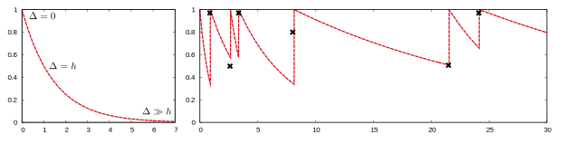

---
title: This Week I Learned - Week 40 2021
slug: til40
date: 2021-09-10 16:29:14 +0100
publications_src: content/til.bib
--- 

## Learning
Fundamental to learning and spaced repetition is the forgetting curve, which states that memory decays exponentially. Online Language Learning Tools like Duolingo have a large amount of learner data, which can be used to optimize their spaced repetition algorithms and at the same time learn about learning. First, let's have a quick look at the maths here. The forgetting curve is  It is given by 

$$p=2^{-\Delta / h}$$

with $p$ the probability of correctly recalling an item, $\Delta$ the lag time since the last practice, and $h$ the half-life, measuring the strength of this item in the long-term memory of the learner.

*Shown on the left side is the memory model assuming no repetition, immediately after learning ( $\Delta=0$ ) the probability for a successful recall is 100%; the right side shows actual learner behavior, with multiple repetitions (Graphic by [@settles2016trainable])*

In practice, we have data on the observed recall, and time lack but miss the half-life $h$ of an item in a learner's memory. Herefore we compile the estimated half-life $\hat{h}_{\Theta}$ for multiple features $x$ (e.g. the number of correctly recalled ) to $\hat{h}_{\Theta}=2^{\Theta \cdot \mathbf{x}}$. The parameter vector $\Theta$ can either be derived from the literature (e.g. for [@leitner1991so] $\Theta=\left\{x_{\oplus}: 1, x_{\ominus}:-1\right\}$ with $x_{\oplus}$ the number of past correct responses and $x_{\ominus}$ the number of incorrect responses) or empirically estimated based on historical learning data. [@settles2016trainable] present *half-life regression* (HLR) a new spaced repetition algorithm, that can improve the prediction of learners' recalls.

## Technology 
* I think we had Side Channel Surveillance and Attacks already in this Blog, where air-gapped computers can leak information by changes in sound, Status LEDs, or other visible influences. In this [new](https://www.scientificamerican.com/article/a-blank-wall-can-show-how-many-people-are-in-a-room-and-what-theyre-doing/) surveillance research by [MIT](http://wallcamera.csail.mit.edu/), a neuronal network can predict the number and activity of people in a room just by looking at not humanly visible shadows at blank walls. [@@sharma2021learn]

### AI 
* I think a combination of [Papers with Code](https://paperswithcode.com/) and [HuggingFace](https://huggingface.co/) will shape how we think of AI research in the future. [@kardas2020axcell] paper on extracting the leaderboard automatically from ML papers is worth a read. It combines Tale type classification, table segmentation, and combining results in leaderboards into an end-to-end pipeline, which is currently live at the Paper with Code Website. Especially notable is their approach to capturing the context of tables, as relevant data is often spread across different sections, e.g. the dataset description in the running test, the model's description in the table, and parameters described in the table caption.

* Beethovens' unfinished 10th Symphony [has been augmented](https://theconversation.com/how-a-team-of-musicologists-and-computer-scientists-completed-beethovens-unfinished-10th-symphony-168160) by Machine Learning to form a coherent musical piece. It seems like currently little details on the technology used are given, but if I would guess I would say they used GANs and provided many human labels.

* [@wood2021fake] at Microsoft trained computer vision models for face-related tasks with only synthetic data. They use rendered data which allows them to have extremely detailed labels like 3D maps, pixel-perfect segmentation. But this also enables them to work with novel use cases, have high diversity in their dataset to reduce bias, or render specific faces that are error-prone. Note on the scale of this operation: Rendering 100,000 images with 512x512 resolution took 48 hours on 150 NVIDIA M60 GPUs. This means  3,000kWh of electricity or $7,2k to render the images.

*Example Faces which are all rendered*