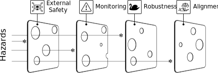

---
title: This Week I Learned - Week 41 2021
slug: til41
date: 2021-10-17 22:55:02 +0100
publications_src: content/til.bib
--- 

## Theatre 
It was my pleasure to represent the UniTheater Karlsruhe at the Multiplier training of the Federal Association for Amateur Theatres. I did a three-day intensive course on stage fighting and choreography with the amazing Florian Federl. Essentially but seemingly just coming up is the topic of consent in amateur theater.

## AI 
I blogged about the [university of the future](/future-uni). This basically follows the arguments by [@@aiined]:   

* Standardised curriculum does not cater to individual needs
* Limited 1-to-1 tutor time available in higher education
* Grading & assessment is time-consuming, with an over-reliance on written tests
* Personalized communication is almost impossible due to scale
* Selecting the best students from a large application pool
* Increasing dropout rates
* The need to effectively combat plagiarism and ensuring authorship 

In Germany these efforts are currently culminate in funding AI in Higher Education with with 133 Mio. €. by the Federal Ministery for Research.

I read [@hendrycks2021unsolved] paper about AI safety and robustness, which I think is a very readable introduction. 
When talking about robustness, problems can be one of two categories
* Black Swans, which happen very rarely and at random with no real outer influence
* Adverserial Attacks, which are carefully crafted with the goal to pose a deceptive threat to models outcome

Robustness means many thinks but I want to highlight just a couple thoughts from the paper: 
* Models should assess their domain of competence accurately and return calibrated unvertainty measures, so models are not overconfident in their competence.
* Systems are more and more  trained on data scraped from
online data. Attackers can poison this data by manipulating data and publishing it online. When models are trained on this data,  that adversaries can poison
* Alignment is a specification problem as human goals are very hard to specify and even harder to measure

This concludes in the *Swiss Cheese Model of AI Safety* where unperfect Protection of the Layers of External Safety (utilizing ML for the safety of ML), Monitoring, Robustness and Alignment combined can increase the security and safety of ML models. 

## Learning 
Something in the line of learning in lecture do not work: Students prefer lecture whith PowerPoint eventhough it  has "no measurable influence on course performance and minimal effect on grades"[@@hill2012m] and on short-term or long-term memory of lecture content. [@@nouri2005effect] A newer study even found that "providing slides to students impacts negatively on their academic performance." [@leon2021impact]

